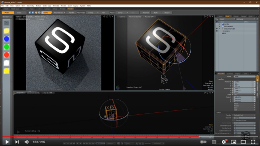
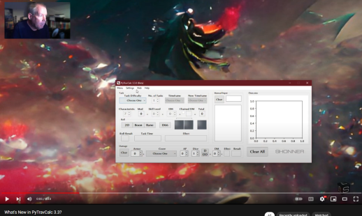

**PyTravCalc**
==============

.. figure:: pytravcalc_manual_cover_art.png

**PyTravCalc** is a Windows program for calculating die rolls for Mongoose Traveller 2nd Edition.

Notes
-----

**PyTravCalc** is being tested on Windows 10.

Read the **PyTravCalc Manual** at http://pytravcalcmanual.readthedocs.io

Download the PDF from https://readthedocs.org/projects/pytravcalcmanual/downloads/pdf/latest

What's New in 3.6?
------------------

**ADVANTAGE** and **DISADVANTAGE** dice types can now be rolled.

What's New in 3.5?
------------------

**colorama** is no longer required.

What's New in 3.4?
------------------

	
What's New in 3.3?
------------------

What's New?
-----------

.. image:: docs/source/video.png
    :target: https://www.youtube.com/watch?v=AlhrqA2jdgs

Requirements
------------

* **Windows 10**

  It might not work in OSX or Linux.

* **Python 3.9**
   
  **PyTravCalc** was written using the C implementation of Python
  version 3.9. Also known as CPython.
   
* **PyQt5 5.15.4**

  PyQt5 is the framework used for displaying the Window GUI and buttons, etc.

* **numpy 1.20.2**

  For building arrays.

* **matplotlib 3.4.2**

  For graphics plotting.
   

Warning
-------

**PyTravCalc** will not work with **Python 2.7-**.

Not Using Python?
-----------------

You can always run the .EXE version for Windows 10 if you don't have the Python language installed.

.. |ss| raw:: html

    <strike>

.. |se| raw:: html

    </strike>

Things To-Do
------------

| Add more dice roll types.
| Cheat codes.
|ss|

| Add Advantage and Disadvantage roll types.
| Make it talk.
| Start on a To-Do.

|se|

**Known History**

* v0.6.1b

  Removed unMute legacy code that wasn't being used.

* v0.6.0b

  Added Advantage and Disadvantage roll types.

* v0.4.0b

  SHONNER Dice are now included.

* v0.1.0b

  Initial release. Back in the Python 2.5 days.

The Traveller game in all forms is owned by Far Future Enterprises. Copyright 1977 - 2022 Far Future Enterprises. Traveller is a registered trademark of Far Future Enterprises.

Contact
-------
Questions? Please contact shawndriscoll@hotmail.com
