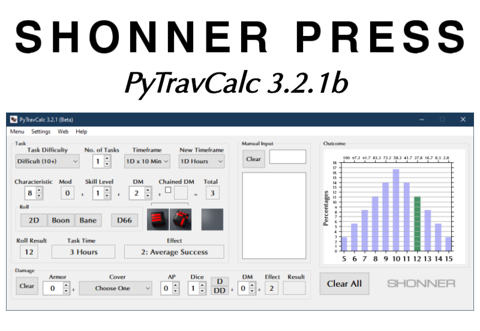

.. image:: docs/source/python_v3_9_5_tag.png
    :target: https://www.python.org/downloads/release/python-395/
    

    
.. image:: https://readthedocs.org/projects/pytravcalcmanual/badge/?version=latest
    :target: http://pytravcalcmanual.readthedocs.io/en/latest/?badge=latest
    :alt: Doc Status

**PyTravCalc 3.1.5b**
===================

**PyTravCalc 3.1.5b** is a Windows program for calculating die rolls for Mongoose Traveller 2nd Edition.

Notes
-----

**PyTravCalc 3.1.5b** is being tested on Windows 10.

New in this release is that it's compatible with Python 3.9 and PyQt5.

Read the **PyTravCalc Manual** at http://pytravcalcmanual.readthedocs.io

Download the PDF from https://readthedocs.org/projects/pytravcalcmanual/downloads/pdf/latest

or the EPUB from https://readthedocs.org/projects/pytravcalcmanual/downloads/epub/latest

Requirements
------------

* **Windows 10**

   It might not work in OSX or Linux.

* **Python 3.9.5**
   
   **PyTravCalc** was written using the C implementation of Python
   version 3.9.5. Also known as CPython.

* **colorama 0.4.4**

   Because CMD may have some colored text messages for debugging invalid die rolls.
   
* **PyQt5 5.15.4**

   PyQt5 is the framework used for displaying the Window GUI and buttons, etc.

* **numpy 1.20.2**

   For building arrays.

* **matplotlib 3.4.1**

   For graphics plotting.
   

Warning
-------

**PyTravCalc** will not work with **Python 2.7-**.

The Traveller game in all forms is owned by Far Future Enterprises. Copyright 1977 - 2021 Far Future Enterprises. Traveller is a registered trademark of Far Future Enterprises.

Contact
-------
Questions? Please contact shawndriscoll@hotmail.com
