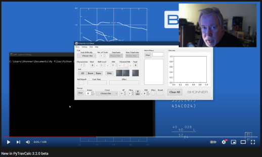

.. image:: docs/source/python_v3_9_11_tag.png
    :target: https://www.python.org/downloads/release/python-3911/
    
.. image:: docs/source/release_v3_5_0b_tag.png
    :target: https://readthedocs.org/projects/pytravcalcmanual/downloads/pdf/latest
    
.. image:: https://readthedocs.org/projects/pytravcalcmanual/badge/?version=latest
    :target: http://pytravcalcmanual.readthedocs.io/en/latest/?badge=latest
    :alt: Doc Status

.. image:: https://img.shields.io/github/stars/ShawnDriscoll/PyTravCalc.svg
    :target: https://github.com/ShawnDriscoll/PyTravCalc/stargazers

**PyTravCalc 3.5.0b**
=====================

**PyTravCalc 3.5.0b** is a Windows program for calculating die rolls for Mongoose Traveller 2nd Edition.

Notes
-----

**PyTravCalc 3.5.0b** is being tested on Windows 10.

Read the **PyTravCalc Manual** at http://pytravcalcmanual.readthedocs.io

Download the PDF from https://readthedocs.org/projects/pytravcalcmanual/downloads/pdf/latest

or the EPUB from https://readthedocs.org/projects/pytravcalcmanual/downloads/epub/latest

What's New in 3.5?

**colorama** is no longer required.

What's New in 3.4?
------------------

.. image:: docs/source/video3.png
    :target: https://www.youtube.com/watch?v=Tyhv1ODB0F0
	
What's New in 3.3?
------------------

.. image:: docs/source/video2.png
    :target: https://www.youtube.com/watch?v=gFvSPnIXNbo

What's New?
-----------

Requirements
------------

* **Windows 10**

  It might not work in OSX or Linux.

* **Python 3.9.11**
   
  **PyTravCalc** was written using the C implementation of Python
  version 3.9.11. Also known as CPython.
   
* **PyQt5 5.15.4**

  PyQt5 is the framework used for displaying the Window GUI and buttons, etc.

* **numpy 1.20.2**

  For building arrays.

* **matplotlib 3.4.2**

  For graphics plotting.
   

Warning
-------

**PyTravCalc** will not work with **Python 2.7-**.

Not Using Python?
-----------------

You can always run the .EXE version for Windows 10 if you don't have the Python language installed.

The Traveller game in all forms is owned by Far Future Enterprises. Copyright 1977 - 2022 Far Future Enterprises. Traveller is a registered trademark of Far Future Enterprises.

Contact
-------
Questions? Please contact shawndriscoll@hotmail.com
