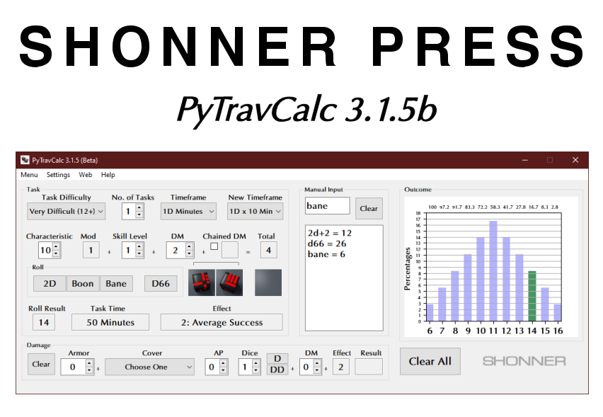

**PyTravCalc Manual**
=====================

**PyTravCalc** is a Windows program for calculating die rolls for Mongoose Traveller
2nd Edition. It's written in Python 3.9 and includes **PyDiceroll** for
its die rolling. Source for **PyDiceroll** can be found at
its `GitHub
<https://github.com/ShawnDriscoll/pydiceroll/>`__ repository.

**PyTravCalc** features minor logging and error tracking at this time.

This documentation explains how to install and use **PyTravCalc** for die roll calculations.

	
The Traveller game in all forms is owned by Far
Future Enterprises. Copyright 1977 - 2022 Far Future
Enterprises. Traveller is a registered trademark of Far
Future Enterprises.

.. toctree::
   :maxdepth: 2

   introduction
   installing
   what_is_new
   tutorial
   license
   ffe
   about_the_author
